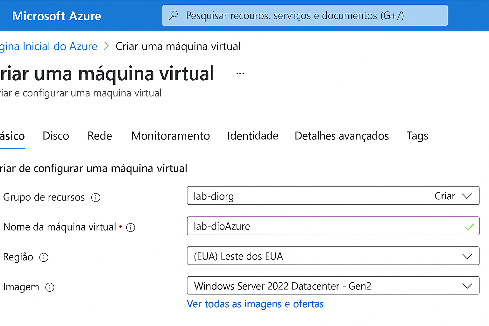
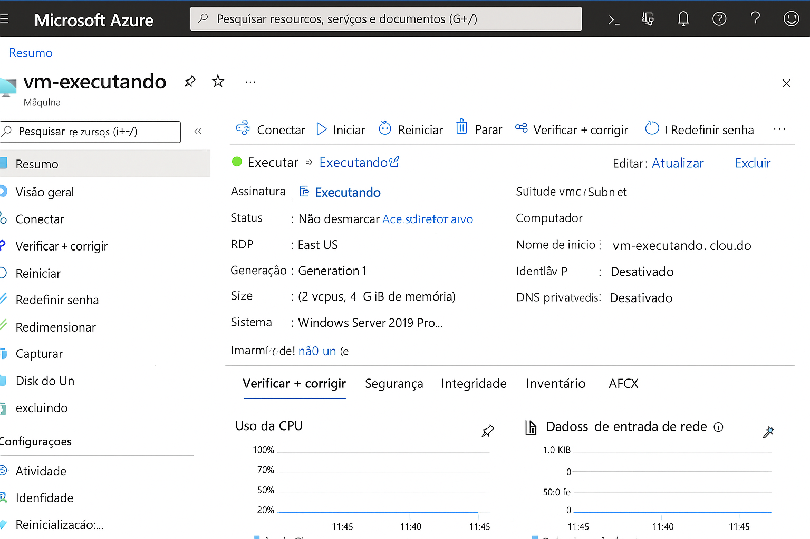

# azure-vm-desafio
Este repositório documenta o desafio proposto pela DIO com foco em máquinas virtuais no Microsoft Azure.

## Resumo das Aprendizagens

Durante este laboratório, aprendi a:

- Criar e configurar máquinas virtuais no Azure.
- Entender os conceitos de alta disponibilidade, escalabilidade e elasticidade na nuvem.
- Gerenciar recursos utilizando o Portal do Azure.
- Documentar o processo de forma clara e organizada para futuras consultas.

## Passos Realizados

1. Criação de uma máquina virtual no Azure.
2. Configuração das opções de rede, segurança e recursos.
3. Testes de funcionamento e acessibilidade.
4. Documentação do processo utilizando Markdown e GitHub.

## Captura de Tela

.

## Conclusão

Este desafio me proporcionou experiência prática no uso da nuvem pública, reforçando os conceitos aprendidos em aula e aprimorando minhas habilidades em documentação técnica.

